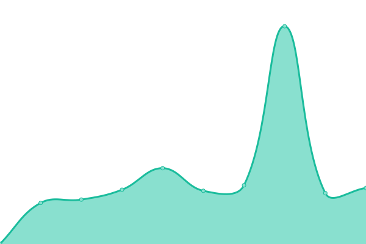
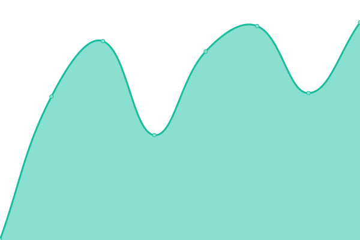

# [📈 Live Status](https://status.l3zc.com): <!--live status--> **🟧 Partial outage**

This repository contains the open-source uptime monitor and status page for [Upptime](https://upptime.js.org), powered by [Upptime](https://github.com/upptime/upptime).

With [Upptime](https://upptime.js.org), you can get your own unlimited and free uptime monitor and status page, powered entirely by a GitHub repository. We use [Issues](https://github.com/upptime/upptime/issues) as incident reports, [Actions](https://github.com/powerfullz/upptime/actions) as uptime monitors, and [Pages](https://status.l3zc.com) for the status page.

<!--start: status pages-->
<!-- This summary is generated by Upptime (https://github.com/upptime/upptime) -->
<!-- Do not edit this manually, your changes will be overwritten -->
<!-- prettier-ignore -->
| URL | Status | History | Response Time | Uptime |
| --- | ------ | ------- | ------------- | ------ |
|  [Blog](https://blog.l3zc.com) | 🟩 Up | [blog.yml](https://github.com/powerfullz/upptime/commits/HEAD/history/blog.yml) | 

 134ms
     
 | 

<a href="https://status.l3zc.com/history/blog">100.00%</a>
    

|  [Raspberry Pi Tunnel](https://rpiblog.l3zc.com) | 🟩 Up | [raspberry-pi-tunnel.yml](https://github.com/powerfullz/upptime/commits/HEAD/history/raspberry-pi-tunnel.yml) | 

 520ms
     
 | 

<a href="https://status.l3zc.com/history/raspberry-pi-tunnel">99.75%</a>
    

|  [RSSHub](https://rsshub.l3zc.com) | 🟥 Down | [rss-hub.yml](https://github.com/powerfullz/upptime/commits/HEAD/history/rss-hub.yml) | 

 1795ms
     
 | 

<a href="https://status.l3zc.com/history/rss-hub">99.98%</a>
    

|  [Iceshrimp](https://social.l3zc.com) | 🟥 Down | [iceshrimp.yml](https://github.com/powerfullz/upptime/commits/HEAD/history/iceshrimp.yml) | 

 460ms
     
 | 

<a href="https://status.l3zc.com/history/iceshrimp">99.99%</a>
    

|  [Umami](https://analytics.l3zc.com) | 🟩 Up | [umami.yml](https://github.com/powerfullz/upptime/commits/HEAD/history/umami.yml) | 

 932ms
     
 | 

<a href="https://status.l3zc.com/history/umami">100.00%</a>
    

|  [Comment API](https://commentapi.l3zc.com) | 🟩 Up | [comment-api.yml](https://github.com/powerfullz/upptime/commits/HEAD/history/comment-api.yml) | 

 713ms
     
 | 

<a href="https://status.l3zc.com/history/comment-api">71.53%</a>
    

<!--end: status pages-->

[**Visit our status website →**](https://status.l3zc.com)

## 📄 License

- Powered by: [Upptime](https://github.com/upptime/upptime)
- Code: [MIT](./LICENSE) © [Anand Chowdhary](https://anandchowdhary.com), supported by [Pabio](https://pabio.com)
- Data in the `./history` directory: [Open Database License](https://opendatacommons.org/licenses/odbl/1-0/)
